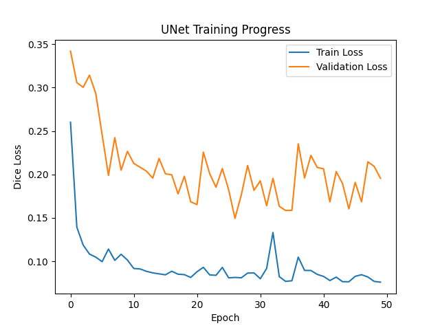

# Segmentation of the HipMRI Study on Prostate Cancer with 2D Improved UNet

# Overview
This task implements a lightweight improved 2D UNet designed for segmentation of HipMRI images
from the HipMRI study on Prostate Cancer. The model keeps a canonical encoder-decoder shape
with symmetric skip connections but introduces a few improvements to stabilise training and 
improve segmentation quality on the medical datasets.

# UNet architecture

On a high level, the UNet architecture takes in a single-channel MRI slice (grayscale) as input
and outputs per-pixel logits for 6 classes (background + 5 tissue labels). It has a base feature 
width of 32 channels and for depth, it has 3 downsampling/ upsampling levels. In its final output 
layer, it has a 1x1 convolution -> multichannel logits.

# Encoder

Each encoder block consists of two 3x3 convolutions (padding=1),
BatchNorm2D after each conv,
ReLU activations,
optional residual/skip inside block,
2x2 MaxPool between blocks to downsample spatial resolution

Channel progression (default): 32 -> 64 -> 128 -> 256 (depending on base_channels)

# Bottleneck

Two conv layers with batch norm + ReLU (same pattern as encoder).
optionally larger channel count to increase representational power.

# Decoder

Each decoder consists of transposed convolution (stride=2) to upsample,
concatenate the upsampled features with encoder skip features,
two 3x3 convs + BatchNorm + ReLU (optionally residual).

This restores the spatial detail while combining coarse and fine features.

# Output

a 1x1 conv to map to num_classes channels.
At inference apply softmax across channel dimensions to get per-class probabilities.

# Improvements made vs a plain UNet

This implementation includes several improvements which includes:

1. Residual connection inside convolutional blocks:
        This makes optimisation easier for deeper nets and helps gradients flow 
        and stabilises training.

2. Batch Normalisation:
        After each convolution to stabilise and speed up convergence.

3. Dropout (configurable):
        Small spatial dropout in decoder/bottleneck to reduce overfitting when training
        data is limited.

4. Dice loss:
        Directly optimises the overlap metric used for evaluation. The dice loss is
        implemented to handle class wise dice and average over classes.

5. Simple, consistent resizing:
        All slices resized to 256x256 so model get consistent inputs

6. Lightweight design:
        Fewer downsampling levels and moderate base_channels (32) to reduce GPU mem and
        training time.

# Data processing and augmentation

Nifti slices were loaded using nibabel.
Slices may have an extra dimension: handled by indexing [...,0] when needed.
Image normalisation: (img - mean) / (std + 1e-8)
Resize to (256, 256) during dataset __getitem__

# Dependencies

The dependencies needed for this project are as listed below: 
    -torch 2.4.0
    -torchvision 0.19.0
    -numpy 1.26.4
    -nibabel 5.2.1
    -matplotlib 3.9.1
    -tqdm 4.66.5

# Training setup

Hyperparameters used:

    Optimizer: Adam
    Learning rate: 0.001
    Batch size: 8 (increase if have more GPU memory)
    Epochs: 50
    Loss: multiclass DiceLoss (implemented in modules.py)
    Device: CUDA if available

Checkpointing:
    
    Script saves:
        unet_epoch{...}.pth every 10 epochs
        unet_best.pth whenever validation loss improves
        unet_latest.pth (final weights)

    During checkpoint save, i also optionally export a small set of prediction images
    (input | predicted mask | ground truth) to an outputs/ folder for visual monitoring.

# Training results

The 2D UNet model was trained on the provided dataset for 50 epochs uisng the CUDA device.
During training, both training and validation losses were monitored to obtain the best epoch

Initial training loss: 0.2601 (epoch 1)
Best validation loss: 0.1495 (epoch 27)
Final training loss: 0.0761 (epoch 50)
Final validation loss: 0.1956 (epoch 50)

Throughout training the model showed steady improvement in performance, with significant
reductions in both training and validation losses during the first 20 epochs.
The validation loss stabilised around later epochs, indicating the model had converged effectively
without severe overfitting.

The best performing model was saved at epoch 27, achieving the lowest validation loss of 0.1495.

# Validation and prediction results

After training, the saved best model was evaluated on the validation dataset using the predict.py
script. The model achieved an average Dice coefficient of 0.8044, demonstrating strong segmentation
accuracy and effective generalization across unseen data.

# References

Ronneberger, O., Fischer, P., & Brox, T. (2015). U-Net: Convolutional Networks for Biomedical 
    Image Segmentation. In W. M. Wells, A. F. Frangi, N. Navab, & J. Hornegger (Eds.), Medical
    Image Computing and Computer-Assisted Intervention -- MICCAI 2015 (Vol. 9351, pp. 234–241).
    Springer International Publishing AG. https://doi.org/10.1007/978-3-319-24574-4_28

Paszke, A., Gross, S., Massa, F., Lerer, A., Bradbury, J., Chanan, G., Killeen, T., Lin, Z., 
    Gimelshein, N., Antiga, L., Desmaison, A., Köpf, A., Yang, E., DeVito, Z., Raison, M., Tejani,
    A., Chilamkurthy, S., Steiner, B., Fang, L., … Chintala, S. (2019). PyTorch: An Imperative Style,
    High-Performance Deep Learning Library. https://doi.org/10.48550/arxiv.1912.01703

DigitalSreeni (2021) 219 - Understanding U-Net architecture and building it from scratch
https://youtu.be/GAYJ81M58y8?si=YuUF7ta1zMeeL2AW

OpenAI. (2025). ChatGPT (GPT-5) Large language model. Retrieved from https://chat.openai.com